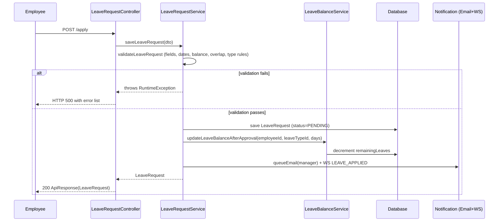
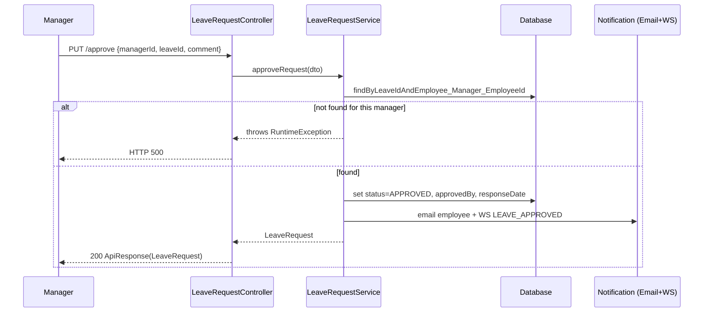
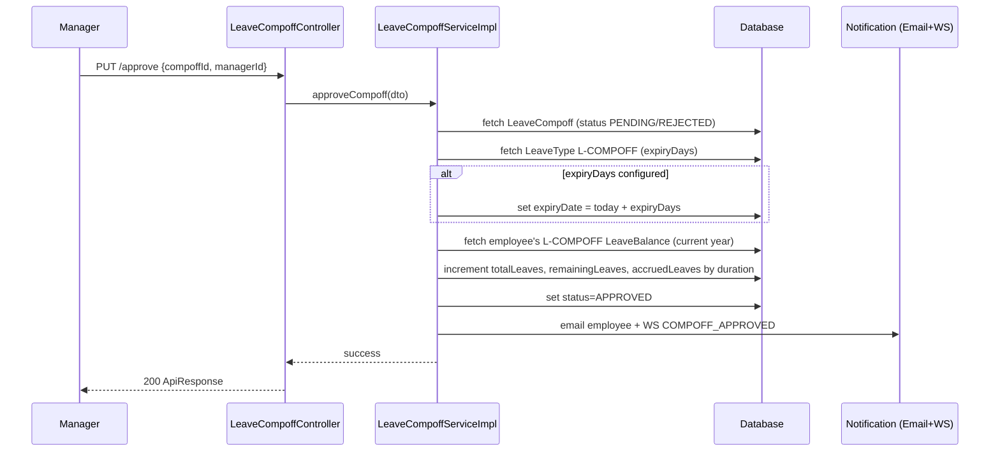
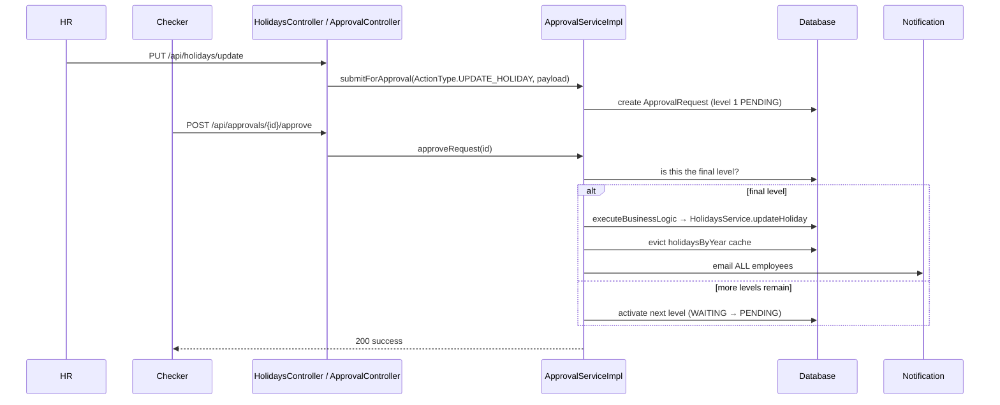

# Functional Design Document — Leave Management System (LMS)

**Scope of this document:** This FDD is reverse-engineered exclusively from the Spring Boot backend at `employee-leave-management` (package `com.paves.employee_leave_management`, 265 Java source files). **No frontend repository was available for analysis** — UI screens, forms, and client-side flows are therefore out of scope. Every workflow, rule, and endpoint below is inferred directly from backend code (controllers, services, entities, schedulers, configuration), not from external documentation. Where the code's actual behavior is ambiguous, incomplete, or inconsistent, this is stated explicitly rather than assumed — such notes appear inline as **⚠ Gap/Ambiguity** callouts and are consolidated in [Section 20](#20-functional-gaps).

**Tech stack** (from `pom.xml` / `application.properties`): Java 21, Spring Boot 3.5.3, Spring Data JPA (MySQL), Spring Security OAuth2 Resource Server (JWT, externally issued), Spring WebSocket (STOMP/SockJS), Spring Kafka (CDC consumer), Redis (Spring Cache + Lettuce, with a Caffeine in-memory fallback), ShedLock (distributed cron locking, JDBC-backed), Thymeleaf (email templates), Apache POI (Excel import/export), Springdoc OpenAPI (Swagger UI), Elasticsearch client (declared but unused).

---

## Table of Contents
1. [Executive Summary](#1-executive-summary)
2. [System Overview](#2-system-overview)
3. [User Roles](#3-user-roles)
4. [Functional Modules](#4-functional-modules)
5. [Module-wise Functional Documentation](#5-module-wise-functional-documentation)
6. [Complete Business Workflows](#6-complete-business-workflows)
7. [End-to-End Flow Diagrams](#7-end-to-end-flow-diagrams)
8. [Business Rules](#8-business-rules)
9. [Validation Rules](#9-validation-rules)
10. [User Interface Documentation](#10-user-interface-documentation)
11. [API Documentation](#11-api-documentation)
12. [Database Documentation](#12-database-documentation)
13. [Security](#13-security)
14. [Notifications](#14-notifications)
15. [Reports & Dashboards](#15-reports--dashboards)
16. [Exception Scenarios](#16-exception-scenarios)
17. [Edge Cases](#17-edge-cases)
18. [Functional Sequence Diagrams](#18-functional-sequence-diagrams)
19. [Assumptions & Dependencies](#19-assumptions--dependencies)
20. [Functional Gaps](#20-functional-gaps)
21. [Glossary](#21-glossary)

---

## 1. Executive Summary

The Leave Management System (LMS) is a Spring Boot backend service that manages the complete employee leave lifecycle for an organization: leave-type policy configuration, balance accrual/carry-forward, leave application/approval, compensatory-off ("comp-off") management, gender-based statutory leave (maternity/paternity), leave revocation, blackout-period blocking, holiday calendars, and audit/compliance tracking.

**Business objectives inferred from the code:**
- Give employees self-service leave application, cancellation, and comp-off request capability.
- Give managers a queue-based approval workflow (single and batch) for their direct reports' leave/comp-off/revoke requests.
- Give HR/Admin a policy-configuration surface (leave types, holidays, gender-based leave) protected by a configurable **maker-checker approval workflow** for higher-risk administrative changes.
- Keep employee master data synchronized with an external HRIS/UMS system via Kafka CDC (Change Data Capture) events.
- Automate the leave-balance lifecycle (accrual, carry-forward, year-end rollover, comp-off expiry) via nightly scheduled batch jobs, coordinated across horizontally-scaled instances using distributed locks (ShedLock).
- Notify stakeholders in real time (WebSocket) and asynchronously (email) of leave-lifecycle events.
- Maintain a compliance audit trail for policy-sensitive entities (leave types, balances, requests, holidays, gender-based leave).

**Primary users**: Employees ("GENERAL"), Reporting Managers, HR staff, HR Managers, Super Admins/Admins, and one integration-only "SYSTEM" role for external consumers (e.g., payroll).

**Key capabilities**: leave application & approval, leave-type/policy administration with effective-dated and future-scheduled changes, automated accrual/carry-forward, comp-off earning/expiry, maternity/paternity leave with statutory constraints, leave revocation, team-level leave blackout periods, holiday calendar management, real-time notifications, and a partially-implemented compliance audit trail.

**Overall assessment**: The system is functionally rich and covers the full leave lifecycle, but the codebase shows clear signs of iterative, multi-author evolution — several features are scaffolded but not fully wired (functional-approver routing, leave-block enforcement, record-lock enforcement, audit-history API, three of five audit mechanisms), and a number of concrete bugs were identified (see [Section 20](#20-functional-gaps)). These are documented factually below, not fixed, per the scope of this exercise.

---

## 2. System Overview

### 2.1 Architecture (high level)

```
                         ┌─────────────────────────────┐
   External UMS/HRIS ───▶│   Kafka (CDC topic)          │
   (source of truth      │   eos_test.eos.employee_...  │
    for employee data)   └──────────────┬───────────────┘
                                         │
                                         ▼
   ┌─────────────────────────────────────────────────────────────────┐
   │                     Leave Management System (this repo)         │
   │                                                                 │
   │  Controllers (REST, /api/**)  ── method-level @PreAuthorize     │
   │        │                                                        │
   │  Services (business logic) ── validation, workflow, scheduling  │
   │        │                                                        │
   │  Repositories (Spring Data JPA) ──────────── MySQL               │
   │                                                                 │
   │  Cross-cutting: Redis+Caffeine cache, ShedLock cron scheduling, │
   │  JPA-listener audit trail, async email queue, STOMP WebSocket    │
   └─────────────────────────────────────────────────────────────────┘
                     │                          │
                     ▼                          ▼
           SMTP (email notifications)   WebSocket clients (real-time UI push)
```

### 2.2 Backend responsibilities
Everything: authentication/authorization enforcement, all business rule validation, all state transitions, all scheduled/batch processing, all notification dispatch, all audit capture, all caching. There is no separate BFF/gateway layer visible in this repository.

### 2.3 External integrations
| Integration | Purpose | Status |
|---|---|---|
| Kafka (`eos_test.eos.employee_details` topic, Debezium-style CDC) | Sync employee master data from an external UMS/HRIS | **Active**, but failure-retry subsystem is effectively dead (see §20) |
| External UMS REST API (hardcoded IP `http://13.48.18.145`) | Bulk-import employees on demand (`POST /api/employee/add-employees`) | **Active**, fragile (hardcoded IP, hardcoded pagination, hardcoded placeholder hire-date) |
| SMTP mail server | All email notifications | **Active** |
| Redis | Distributed cache | **Active**, with automatic Caffeine in-process fallback if Redis is unreachable |
| Elasticsearch | Declared dependency, config class present | **Not implemented** — `ElasticsearchConfig` is fully commented out |
| MySQL | System of record | **Active** |

### 2.4 Major subsystems
Employee/Identity, Leave Request & Manager Approval, Maker-Checker Admin Approval Engine, Leave Type Configuration, Leave Balance/Accrual, Gender-Based Leave, Comp-Off, Leave Revoke, Leave Block, Holiday Calendar, Record Locking, Notifications (Email+WebSocket), Audit Trail, Scheduled Jobs, Caching, CDC Integration.

---

## 3. User Roles

Roles are carried as string claims (`roles`, `permissions`) inside an externally-issued JWT and mapped to Spring `GrantedAuthority`s (`ROLE_<X>` for roles, raw strings for permissions) — there is **no role/permission enum or constants class in this codebase**; every `@PreAuthorize` annotation uses inline string literals, which is itself a maintenance risk (a typo would silently fail closed). The roles below are the literal strings found across all `@PreAuthorize`/`hasRole`/`hasAnyRole` annotations in the codebase.

| Role (literal string used in code) | Responsibilities observed | Representative accessible modules |
|---|---|---|
| **GENERAL** (default employee) | Apply/edit/cancel own leave, request/cancel own comp-off, request revoke of own leave | Leave Request, Comp-off, Leave Revoke (submit only) |
| **REPORTING_MANAGER** / **MANAGER** (used inconsistently — see §20) | Approve/reject/edit direct reports' leave and comp-off requests (single + batch), create/manage leave blocks, approve/reject revoke requests | Leave Approval, Comp-off Approval, Leave Block, Leave Revoke Approval |
| **HR** | Manage employees, leave types, holidays, gender-based leave, leave balances; submit maker-checker requests for policy changes (non-Admin makers always go through approval) | Employee Mgmt, Leave Type, Leave Balance, Holidays, Gender-Based Leave, Maker-Checker (as maker & as approver depending on rule) |
| **HR_MANAGER** / **HR-MANAGER** (both spellings appear) | Checker/approver tier for maker-checker workflow; participates in record-lock and revoke-approval role lists | Maker-Checker approval, Record Lock, Leave Revoke |
| **SUPER_ADMIN** | Highest-privilege role; bypasses maker-checker for several admin actions (direct-apply instead of submit-for-approval); full employee/leave-type/balance CRUD | All modules |
| **ADMIN** | Used specifically for CDC failure-log visibility and holiday-template download; **appears to be a distinct role from SUPER_ADMIN in the code** despite conceptually overlapping — not reconciled anywhere | CDC monitoring, Holidays (template download) |
| **SYSTEM** | Integration-only role for two endpoints returning org-wide/employee approved-leave data by year (likely consumed by an external payroll/reporting system, not a human user) | Read-only approved-leave export |

⚠ **Gap**: `MANAGER` and `REPORTING_MANAGER` both appear across different controllers referring to what appears to be the same real-world role, with no normalization layer — an actual JWT would need to carry whichever literal string each specific endpoint expects, or endpoints would silently reject a legitimately-a-manager user. Similarly `HR_MANAGER` vs `HR-MANAGER` (underscore vs hyphen) appear in different files.

**Permission-style checks** (evaluated via a `PermissionService` Spring bean referenced in `@PreAuthorize` SpEL expressions, layered on top of role checks): `isOwner`, `isManager`, `isOwnerOfLeaveRequest`, `isManagerOfLeaveRequest`, `isOwnerOfCompoffRequest`, `isManagerOfCompoffRequest` — these enforce that a caller can only act on their own records or records of people they manage, even if their role would otherwise permit the endpoint.

---

## 4. Functional Modules

| # | Module | One-line purpose |
|---|---|---|
| 1 | Authentication & Authorization | JWT validation, role/permission extraction, ownership/management checks |
| 2 | Employee Management & CDC Sync | Employee master data CRUD + Kafka-driven sync from external UMS |
| 3 | Leave Request Management | Apply, edit, cancel, view leave requests |
| 4 | Leave Approval (Manager-level) | Manager approve/reject/edit of direct reports' leave requests |
| 5 | Maker-Checker Approval Engine | Configurable multi-level approval workflow for admin/HR policy actions |
| 6 | Leave Type Configuration | CRUD of leave-type policies, effective-dated and scheduled changes |
| 7 | Leave Balance & Accrual | Balance calculation, accrual, carry-forward, manual adjustment |
| 8 | Gender-Based Leave | Maternity/paternity leave type & balance management |
| 9 | Comp-Off Management | Earn, approve, reject, cancel, expire compensatory-off leave |
| 10 | Leave Revoke | Undo an already-submitted leave request post-hoc |
| 11 | Leave Block | Team/project blackout periods restricting leave application |
| 12 | Holiday Calendar | Manage the organizational holiday calendar, per state/country |
| 13 | Record Locking | Short-lived concurrency guard on leave_request/leave_balance rows |
| 14 | Notifications | Email (queued + direct) and real-time WebSocket push |
| 15 | Audit Trail | Change-tracking for compliance-sensitive entities |
| 16 | Scheduled Jobs / Batch Processing | Nightly and frequent cron jobs orchestrating the above |
| 17 | Caching Infrastructure | Redis-backed cache with automatic local fallback |
| 18 | Exception Handling & Bulk Upload | Global error contract; Excel-based bulk import for balances/holidays |
| 19 | CDC / External Integration | Kafka consumer syncing employee data from source-of-truth HRIS |

---

## 5. Module-wise Functional Documentation

### 5.1 Authentication & Authorization
**Purpose**: Validate the caller's identity and determine what they can access, without this system issuing its own credentials.
**Features**: JWT (OAuth2 Resource Server) validation against an external issuer; custom bearer-token resolution supporting both `Authorization` header and `?token=` query param (the latter specifically to support WebSocket/SockJS handshakes that can't set headers); role/permission-to-authority mapping; a "whoami" diagnostic endpoint.
**Inputs**: Bearer JWT (header or query param).
**Outputs**: `UserDTO` (id, email, name, roles, permissions) via `@CurrentUser`; 401/403 error responses.
**Business rules**: Authorities are derived per-request from the JWT's `roles`/`permissions` claims — there is no local user/role table to keep in sync.
**Dependencies**: External JWT issuer (OAuth2 resource-server config), `PermissionService` for fine-grained ownership checks.
**Error handling**: `CustomAuthenticationEntryPoint` → 401 (`{"detail":"Unauthorized"}` or `{"detail":"token has expired"}` via message-substring matching); `CustomAccessDeniedHandler` → 403.
**Edge cases / ⚠ Gap**: `SecurityConfig` marks `/api/**` as `permitAll()` at the HTTP-filter layer — actual access control for every REST endpoint depends **entirely** on method-level `@PreAuthorize`. Any endpoint missing that annotation (several were found — see §11) is reachable by an unauthenticated caller. `JwtUtils.java` is dead/commented-out code superseded by the resource-server claim extraction.

### 5.2 Employee Management & CDC Sync
**Purpose**: Maintain the employee master record that every other module keys off, kept in sync with an external HRIS/UMS.
**Features**: Employee registration/update (self-service and HR-driven), bulk import from UMS, manager/HR/HR-administrator hierarchy, employee search, Kafka-driven CDC upsert/delete with out-of-order-event backfill.
**User journey**: HR registers an employee (or it arrives via CDC) → employee record includes manager/HR linkage → employee can now log in (externally authenticated) and self-serve leave.
**Business rules**: Employee ID auto-generated (`PAVEMP` + 5 random hex chars) only if not already supplied; CDC-driven creation always supplies an ID from the source system's UUID. Manager/HR linkage is deferred (not failed) if the referenced manager/HR doesn't exist yet in LMS — a "backfill" pass retroactively links records once the manager arrives, solving CDC event-ordering issues.
**Database impact**: `employee` table with self-referencing FKs (`managerId`, `hrId`) plus optional `hrAdministrator`.
**APIs used**: `EmployeeController` (`/api/employee/**`), `CdcFailureLogController` (`/api/cdc/**`).
**Error handling**: `EmployeeExceptionHandler` → 400 for not-found/duplicate; `DataIntegrityViolationException` → 409 (but the update path pre-empts this and returns 400 instead — inconsistent, see §20).
**Edge cases**: Employee soft-delete (CDC delete event) sets status `INACTIVE`, never hard-deletes. CDC upsert of an unrecognized `employment_status` string throws `IllegalArgumentException` (no normalization table) and, per a confirmed gap, is **silently dropped** rather than retried (see §20).

### 5.3 Leave Request Management
**Purpose**: Let employees apply for, edit, and cancel leave; let HR apply leave on an employee's behalf.
**Features**: Apply, employee self-edit (pending only), manager edit (any status), employee cancel (pending only), rich filtering (by employee/year/status/date-range), overlap pre-check, balance pre-check, "apply on behalf."
**Business rules**: Leave balance is **deducted at submission time**, not at approval time — a `PENDING` request already reserves the balance. Editing rolls back the old balance debit and re-applies a new one after re-validating all rules from scratch.
**Validation rules**: See [Section 9](#9-validation-rules) in full — mandatory fields, date constraints, balance sufficiency, overlap detection, leave-type-specific rules (sick/earned/maternity/paternity/comp-off/unpaid), half-day eligibility, past-date limits, advance-notice requirements.
**Database impact**: `leave_request` / `leave_detail` tables; touches `leave_balance` or `gender_leave_balance` on every apply/edit/cancel.
**APIs used**: `LeaveRequestController` (`/api/leave-requests/**`), 25 endpoints.
**Error handling**: Predominantly generic `RuntimeException` → HTTP 500 for business failures (a real API-contract inconsistency — see §20); a smaller subset use `LeaveBalanceExceptionHandler`/404/400 appropriately.
**Edge cases**: Manager can edit a request in *any* status with no guard; re-approving an already-terminal request is possible with no re-debit of balance (potential balance/status desync — see §20).

### 5.4 Leave Approval (Manager-level)
**Purpose**: Give a direct manager a queue to approve/reject/batch-process their reports' leave requests.
**Features**: Single approve/reject with comment, batch approve/reject (all-or-nothing transaction), manager edit of a request, pending-count badge, manager request/history queue (both currently backed by an identical query — see §20).
**Business rules**: Authorization = caller must literally be `Employee.manager` of the request's employee — no delegate-approver, no second-level escalation for regular leave approval (that only exists in the separate Maker-Checker engine, §5.5). "Cancel" from the manager side is implemented as an alias into the reject method (approved leave → `CANCELLED`; anything else → `REJECTED`).
**Error handling**: `RuntimeException` → 500 across most of this module.
**Edge cases**: No optimistic locking (`@Version` field present on `LeaveRequest` but commented out) — concurrent approve/reject race is possible. No escalation/timeout automation despite a `findOverdueRequests` repository query existing unused (feeds only the notification digest, not a workflow action).

### 5.5 Maker-Checker Approval Engine
**Purpose**: A generic, configurable multi-level approval workflow for **administrative/HR actions** — distinct from and unrelated to leave-request approval. Governs: create/update/deactivate leave type, update employee leave balance, add/update/delete holiday, create/update/deactivate gender-based leave, year-end leave processing.
**Features**: Admin UI can configure one `ApprovalRule` per `ActionType` (maker role, checker role, approval level, approver type). Submission creates one `ApprovalRequest` row per matching rule under a shared `workflowId`; only the final level's approval actually executes the business action.
**Business rules**: `SUPER_ADMIN` (and, for some actions, `ADMIN`) bypasses this workflow entirely via a direct-apply code path; every other role's equivalent action is routed through submission-for-approval. Rejection at any level cancels all other still-waiting levels in the same workflow.
**⚠ Major gap**: Of the four `ApproverType` values (`LINE_MANAGER`, `FUNCTIONAL_APPROVER`, `ROLE_BASED`, `DIRECT_MAPPING`), **only `DIRECT_MAPPING` is implemented** — selecting any of the other three in the admin UI will throw `UnsupportedOperationException` the first time a request tries to route through it. Additionally, rule creation currently allows **only one rule per `ActionType`**, which caps every workflow at a single approval level in practice even though the runtime engine supports N levels.
**Error handling**: `ApprovalBusinessException` → 422, specifically used to signal "the final approval succeeded procedurally but the business guard failed" (e.g., can't deactivate a leave type with pending requests) — captured via a side-channel transaction so the failure reason survives the parent rollback.

### 5.6 Leave Type Configuration
**Purpose**: Define the catalog of leave types (Sick, Earned, Unpaid, Comp-off) and their policy parameters.
**Features**: Create/update/deactivate, future-effective-dated changes (via inactive-row + nightly activation, or via `ScheduledLeaveTypeUpdate` for updates), pending-activation cancellation, accrual-rate auto-derivation, async batch balance-provisioning job with automatic rollback on partial failure.
**Business rules**: Only six leave-type names are supported, each with a fixed generated ID (`L-ML`, `L-PL`, `L-SL`, `L-EL`, `L-UP`, `L-COMPOFF`); accrual rate is always derived as `maxDaysPerYear / 12`, never entered directly; only one `PENDING` scheduled update allowed per leave type at a time; deactivation is blocked while any `PENDING` leave/comp-off request references that type, and — once allowed — **hard-deletes** all balance rows for that type (not a soft delete); reactivating an inactive leave type with the same name silently overwrites all its prior configuration.
**Notifications**: All employees are emailed on creation, update, and deletion of any leave type.
**Edge cases**: If the async balance-provisioning job fails partway for any single employee, it deletes every balance row it already created **and deactivates the newly-created leave type**, forcing HR to recreate it from scratch.

### 5.7 Leave Balance & Accrual
**Purpose**: Track and automatically grow each employee's leave entitlement per type per year.
**Features**: Nightly accrual (frequency-driven: daily/weekly/fortnightly/monthly/quarterly/yearly), mid-year-joiner proration (15th-of-month threshold), year-end carry-forward with per-year and lifetime caps, manual HR balance adjustment (via maker-checker), bulk Excel upload, dashboards.
**Business rules**: Unpaid leave (`L-UP`) is exempt from balance tracking on approval/rejection (treated as unlimited). Balance deduction happens at leave submission; rejection/cancellation/revoke-approval restores it.
**Database impact**: `leave_balance` table, one row per employee/leave-type/year.
**Edge cases / ⚠ Gap**: A confirmed HR-scoping bug — one "non-admin" balance-listing method queries with no HR-team scoping at all, identical to the admin branch, so any HR user calling that endpoint sees every employee's balances regardless of their intended team scope.

### 5.8 Gender-Based Leave (Maternity/Paternity)
**Purpose**: Statutory maternity/paternity leave, modeled separately from regular accrual-based leave because it's a lump-sum entitlement, not accrued.
**Features**: HR-only creation/update (maker-checker gated unless Super Admin), gender-eligibility filtering at balance-provisioning time, fixed total-day entitlements, usage-count caps.
**Business rules**: Maternity leave requires the requested days to exactly equal the configured `maxLeaveDays` once a "long leave" threshold is met; capped at `maxNoOfTimes` such requests. Paternity leave additionally enforces a minimum 365-day gap since the last approved paternity leave.
**⚠ Gap**: Two independent services perform the same gender-eligibility filtering; one has an explicit null-gender guard, the other does not and will throw `NullPointerException` for any employee with no recorded gender.

### 5.9 Comp-Off Management
**Purpose**: Let an employee earn and later spend compensatory time off (typically for working a holiday/weekend), subject to manager approval.
**Features**: Request (self-declared, no timesheet cross-check), manager approve/reject, employee cancel, automated nightly expiry.
**Business rules**: 28-day backdating limit on the request; a mandatory comment; no-overlap check against the employee's own existing comp-off requests. Approval **credits** the comp-off leave-balance row immediately (this is literally how comp-off "becomes" usable leave); rejection reverses a prior credit (floored at zero); expiry (if the comp-off leave type has `expiryDays` configured) debits any unused credited balance.
**⚠ Gap**: The one cancel endpoint actually wired to the UI does not reverse an already-approved (balance-credited) comp-off, unlike the reject path — cancelling an approved comp-off leaves the balance inflated.

### 5.10 Leave Revoke
**Purpose**: Undo an already-submitted leave request after the fact — regardless of its current status — via a secondary approval by the employee's manager.
**Features**: Submit (HR, manager, or the employee themselves can raise it), manager approve/reject.
**Business rules**: Duplicate revoke submissions are blocked while one is already pending/approved for the same leave request. Approval sets the underlying `LeaveRequest` to `CANCELLED` and restores the balance — this is the actual mechanism by which a revoke takes effect.
**⚠ Gap**: No deadline/eligibility restriction exists — a revoke can be approved for leave dates long past. The employee-facing notification email for a completed revoke is dead code (commented out) — only the WebSocket push fires, so an offline employee is never told their leave was revoked.

### 5.11 Leave Block (Blackout Periods)
**Purpose**: Let a manager freeze specific employees from applying for specific leave types during a date range tied to a project (e.g., a release freeze).
**Features**: Create (member × leave-type cross-product), partial/full unblock, update, forced deactivation, automatic nightly activation/expiry by schedule.
**⚠ Major gap**: The block mechanism writes an `isBlocked`/`blockId` marker onto the affected `LeaveBalance` rows, but **no code anywhere in leave-request validation actually reads that flag** — meaning a leave block, as currently wired, does not appear to prevent an employee from applying for leave during a "blocked" period. The companion `LeaveBlockException` entity (meant to model per-employee exemptions from a block) has zero service/repository/controller wiring — it is a schema-only, unimplemented feature.

### 5.12 Holiday Calendar
**Purpose**: Maintain the organization's public/regional/optional holiday calendar, scoped per state/country/year.
**Features**: CRUD (add is role-gated direct-vs-approval; update/delete always go through maker-checker regardless of role), bulk Excel import/export, year-scoped and month-scoped queries, a stateless "is this date a holiday" check endpoint.
**Business rules**: Uniqueness enforced on `(date, state, year)`. A 3-year-old retention cleanup exists (`deleteHolidaysThreeYearsAgo`) but is only invoked as a side-effect of a year-end leave-processing routine, not on its own schedule. Adding/updating/deleting a holiday broadcasts an email to **every employee** in the company, unscoped by state/location.
**Cross-domain dependency**: Weekend/holiday exclusion from leave-day counts is implemented only inside leave-request *reporting* aggregation methods — not in balance-deduction or request-validation logic.

### 5.13 Record Locking
**Purpose**: A short-lived (10-minute TTL) mutex over specific `leave_request`/`leave_balance` rows, intended to prevent two people editing the same record at once.
**Features**: Lock/refresh/release/check, with a bidirectional cross-table conflict guard (locking a leave request blocks locking the employee's related leave balance and vice versa), automatic 5-minute-interval cleanup of expired locks.
**⚠ Major gap**: No leave-request or leave-balance mutation code anywhere actually checks lock status before writing — the lock is purely advisory and only meaningful if a frontend client disciplines itself to call the lock endpoints before/after editing. The backend does not enforce it.

### 5.14 Notifications (Email + WebSocket)
**Purpose**: Keep employees/managers informed of leave-lifecycle events in near-real-time (WebSocket) and durably (email).
**Features**: An in-memory (non-persistent) email queue drained every 60 seconds; a parallel direct-synchronous send path for the daily digest; 15+ distinct notification types across leave/comp-off/revoke/policy/holiday events; targeted per-user WebSocket push over STOMP/SockJS with JWT-authenticated connections.
**⚠ Major gap**: The scheduled pending-approval-reminder and overdue-approval-escalation jobs reference Thymeleaf templates (`pending-approval-digest.html`, `overdue-approval-digest.html`) that **do not exist on disk** — these two nightly jobs will throw a template-not-found error every time a manager has pending/overdue requests. Two other templates that *do* exist on disk (`pending-approval-reminder.html`, `overdue-approval-escalation.html`) are orphaned — their corresponding single-recipient service methods are never called.
**Business rules**: No deduplication/throttling anywhere — a stale pending request generates a fresh reminder email every single night indefinitely. No retry on send failure (failed emails are simply dropped, not re-queued).

### 5.15 Audit Trail
**Purpose**: Capture who changed what, when, on compliance-sensitive entities (leave types, balances, requests, holidays, gender-based leave/balances).
**Features**: JPA-entity-listener-driven full-row snapshotting into dedicated per-entity audit tables (the one actually active mechanism), plus a single AOP-based before/after diff capture wired to exactly one HR bulk-balance-override method.
**⚠ Major gap**: This codebase contains **five parallel audit implementations** across four packages (`audit`, `audit_new`, `audit_entities`, `audit_tables`, plus scattered `auditRepo`/`auditLogRepo`/`auditUtils`); only the JPA-listener mechanism (and the single AOP use) is actually wired to any entity — the rest (an event-driven field-level-diff redesign, a generic `AuditService`/`AuditContext`, an orphaned second JPA listener) are dead code with zero runtime effect. **No API endpoint exists anywhere to retrieve audit history** — it is write-only, queryable only via direct database access. There is also no retention/purge policy — audit tables grow unbounded.

### 5.16 Scheduled Jobs / Batch Processing
**Purpose**: Automate the nightly and frequent housekeeping that keeps balances, leave types, blocks, comp-offs, holidays, and locks self-maintaining.
**Features**: A single midnight-IST "master batch" running 11 named sub-jobs sequentially (leave-block activation/expiry, leave-type activation/scheduled-update/deactivation, comp-off expiry, accrual, daily digest, pending-reminder, overdue-escalation, old-log purge); a 5-minute "frequent" job (expired record-lock cleanup); a 10-minute CDC-retry job; a 60-second email-queue drain; a 30-second Redis health probe. All cron jobs (except the intentionally per-instance Redis probe) are coordinated via ShedLock so only one instance in a horizontally-scaled deployment executes a given job.
**Database impact**: `JobExecutionLog` records start/end/duration/status/error for every sub-job run, purged after 30 days — but has **no API to view it**, DB-only.

### 5.17 Caching Infrastructure
**Purpose**: Reduce DB load for frequently-read, infrequently-changed data (leave types, holidays, balances, dropdowns).
**Features**: A custom `CacheManager` that live-probes Redis health and transparently swaps to a local Caffeine cache if Redis is unreachable — no request ever blocks or errors due to a Redis outage. Startup behavior flushes the entire configured Redis logical database and pre-warms the leave-type cache.
**⚠ Gap**: The full-DB flush on every app startup is not scoped to this app's own keys — if the Redis logical DB is ever shared with another service, every deploy of this app would wipe that other service's cache too.

### 5.18 Exception Handling & Bulk Upload
**Purpose**: Provide a consistent error contract to API consumers, and a resilient Excel-based bulk-import path for leave balances, gender-based balances, and holidays.
**Features**: A global `@RestControllerAdvice` mapping ~9 exception types to HTTP statuses in an `ApiResponse{success, message, data}` envelope; per-row error accumulation during Excel parsing so one bad row doesn't abort the whole file's validation feedback, but the actual commit is all-or-nothing (any row error rolls back the entire transaction).
**⚠ Gap**: `UploadValidationException` (which carries the per-row error list) is **not registered** in the global handler at all — it only works today because the one controller that throws it also happens to catch it locally; any other future caller would silently lose the row-level detail to the generic 500 handler.

### 5.19 CDC / External Integration
**Purpose**: Keep the LMS employee table synchronized with an authoritative external HRIS/UMS via Kafka Change Data Capture events (Debezium-style envelope).
**Features**: Upsert/delete handling with safe-default field mapping, out-of-order-event backfill (a subordinate arriving before their manager is retroactively linked once the manager arrives), a full retry/failure-log subsystem with an ops-visibility API.
**⚠ Major gap**: The retry/failure-log subsystem (`CdcFailureLog`, `CdcRetryScheduler`, `/api/cdc/failures`) is fully built but **currently dead in practice** — the live consumer's exception handling only logs and swallows failures; it never actually writes a `CdcFailureLog` row, so nothing is ever retried and the ops dashboard never shows anything, regardless of how many CDC messages actually fail.

---

## 6. Complete Business Workflows

### 6.1 Leave Application
- **Trigger**: Employee (or HR on their behalf) submits a leave request.
- **Preconditions**: Employee exists; leave type exists and is active; employee has a current-year balance row for that type.
- **Flow**: Validate (mandatory fields → date constraints → balance sufficiency → overlap → type-specific rules) → if valid, persist as `PENDING` → immediately deduct balance → email + WebSocket-notify the manager.
- **Decision points**: Regular vs. gender-based leave type (mutually exclusive path); sick leave >3 days requires documentation; unpaid leave is balance-exempt.
- **Alternate flows**: HR "apply on behalf" (same validation, different `appliedBy`).
- **Failure scenarios**: Any validation failure aborts with no partial persistence (accumulated error list returned) — but surfaces as an HTTP 500, not 400 (see §20).
- **End result**: A `PENDING` leave request with balance already reserved, awaiting manager decision.

### 6.2 Leave Approval
- **Trigger**: Manager approves a pending request (single or batch).
- **Preconditions**: Caller is the literal `Employee.manager` of the requester.
- **Flow**: Match request by `(leaveId, managerId)` → set status `APPROVED` → no further balance change (already deducted at apply time) → email + WebSocket-notify the employee.
- **Decision points**: None beyond manager-match; **no status-transition guard** — an already-approved/rejected/cancelled request can be re-approved.
- **Failure scenarios**: Request not found for that manager → exception → HTTP 500.
- **End result**: `APPROVED` status; employee notified.

### 6.3 Leave Rejection
- **Trigger**: Manager rejects a request; mandatory comment.
- **Flow**: If current status is `APPROVED` → set `CANCELLED` (this is also how "manager cancel" is implemented); else → set `REJECTED`. Restore balance either way. Email + WebSocket-notify employee.
- **End result**: `REJECTED` or `CANCELLED`, balance restored.

### 6.4 Leave Cancellation (employee-initiated)
- **Trigger**: Employee cancels their own request.
- **Preconditions**: Status must be `PENDING`.
- **Flow**: Set `CANCELLED` → restore balance → notify manager.
- **Failure scenario**: Attempting to cancel a non-pending request → `RuntimeException` ("Cannot cancel a leave request that is not pending") → HTTP 400.

### 6.5 Leave Balance Generation (new leave type)
- **Trigger**: HR/Super-Admin creates or reactivates a leave type with an immediate (today-or-past) effective date.
- **Flow**: Leave type activated → async batch job created (`LeaveBalanceJob`, status `PENDING`) → per-employee balance row created in its own sub-transaction, progress polled by job ID → on completion, status `COMPLETED`.
- **Failure scenario**: Any single-employee failure rolls back **the entire job** — deletes all balances it created so far and **deactivates the newly-created leave type**, requiring HR to start over.
- **End result**: Every employee has a balance row for the new type, or the type is rolled back entirely.

### 6.6 Leave Type Creation
- **Trigger**: `POST /api/leave/add-leave-type`.
- **Decision point**: effective date today/past → immediate activation + balance job (§6.5); effective date future → row inserted inactive, picked up by the nightly scheduler on its effective date.
- **Alternate flow**: Non-Admin maker → routed through Maker-Checker approval instead of direct creation.
- **End result**: Active (or scheduled-to-activate) leave type; all employees emailed.

### 6.7 Leave Type Update
- Same immediate-vs-future branching as creation, but future updates use `ScheduledLeaveTypeUpdate` (one pending record per leave type max) rather than an inactive row. Immediate updates recompute accrual rate and recalculate **only current-year** balances (explicitly scoped to avoid corrupting closed years).

### 6.8 Comp-Off Request → Approval → Credit
- **Trigger**: Employee submits a comp-off request (self-declared work day, no timesheet check).
- **Preconditions**: 28-day backdating limit, mandatory note, no overlap with existing pending/approved comp-off requests, employee must have an assigned manager.
- **Flow**: `PENDING` → manager approves → (if the comp-off leave type has `expiryDays` configured) sets an expiry date → **credits** the employee's comp-off leave balance by the requested duration.
- **Alternate flow**: Manager can also reject an already-approved comp-off, which reverses the credit (floored at zero).
- **Scheduled flow**: Nightly job expires any `APPROVED` comp-off past its expiry date and debits the balance.
- **End result**: Usable comp-off leave balance, or an expired/rejected/cancelled record with no (or reversed) balance impact.

### 6.9 Manager Approval — Leave Revoke
- **Trigger**: HR/manager/employee submits a revoke request against an existing leave request (any status).
- **Precondition**: No existing pending/approved revoke already open for that same leave request.
- **Flow**: `PENDING` revoke → manager approves → underlying `LeaveRequest.status` forced to `CANCELLED` → balance restored → revoke record marked `APPROVED`.
- **Alternate flow**: Manager rejects → revoke marked `REJECTED`, no other side effects.
- **End result**: The original leave is nullified and its balance returned to the pool, regardless of how much time has passed since it was originally approved.

### 6.10 Holiday Management
- **Trigger**: HR/Admin adds, updates, or deletes a holiday.
- **Decision point**: `SUPER_ADMIN`/`ADMIN` adding a holiday → applied immediately; any other role adding, or **anyone** updating/deleting → routed through Maker-Checker approval.
- **Flow (on execution)**: Uniqueness check on `(date, state, year)` → persist/modify/remove → cache evicted → all employees emailed.
- **End result**: Updated holiday calendar; company-wide broadcast email.

---

## 7. End-to-End Flow Diagrams

**Leave Application → Approval**
```
Employee
  │
  ▼
Apply for Leave (LeaveRequestController /apply)
  │
  ▼
Validation (mandatory fields, dates, type-specific rules)
  │
  ▼
Leave Balance Check (current-year balance row, sufficiency)
  │
  ▼
Overlap Check (existing pending/approved requests)
  │
  ▼
Save as PENDING + Deduct Balance Immediately
  │
  ▼
Notify Manager (Email + WebSocket LEAVE_APPLIED)
  │
  ▼
Manager Approves ──────────────► Manager Rejects
  │                                    │
  ▼                                    ▼
Status = APPROVED                Status = REJECTED (or CANCELLED if was APPROVED)
  │                                    │
  ▼                                    ▼
Notify Employee                  Restore Balance + Notify Employee
```

**Comp-Off Lifecycle**
```
Employee requests Comp-Off (self-declared work day)
  │
  ▼
Validation (28-day backdating limit, mandatory note, no overlap)
  │
  ▼
Status = PENDING → Notify Manager
  │
  ▼
Manager Approves ─────────────► Manager Rejects
  │                                   │
  ▼                                   ▼
Credit comp-off leave balance    (if was approved) reverse credit
Set expiry date (if configured)  Status = REJECTED
Status = APPROVED
  │
  ▼
[Nightly Job] expiryDate passed? ── Yes ──► Status = EXPIRED, debit balance
  │
  No → remains usable
```

**Leave Type Creation → Balance Provisioning**
```
HR/Admin submits new Leave Type
  │
  ▼
Effective date today/past? ── No ──► Insert inactive → [Nightly Scheduler activates on effective date]
  │ Yes
  ▼
Activate immediately
  │
  ▼
Async LeaveBalanceJob starts (per-employee, batched)
  │
  ▼
Any employee fails? ── Yes ──► Roll back all created balances + DEACTIVATE the leave type
  │ No
  ▼
Job COMPLETED — all employees provisioned
  │
  ▼
Email all employees: "New Leave Policy"
```

**Holiday Maker-Checker Flow**
```
HR submits Add/Update/Delete Holiday
  │
  ▼
Role check: SUPER_ADMIN/ADMIN adding? ── Yes ──► Apply immediately
  │ No (or any Update/Delete regardless of role)
  ▼
Submit ApprovalRequest (Maker-Checker engine)
  │
  ▼
Checker approves at final configured level
  │
  ▼
Execute business action (add/update/delete Holiday)
  │
  ▼
Evict holiday cache → Email ALL employees
```

---

## 8. Business Rules

| Rule | Purpose | Trigger | Outcome | Where applied |
|---|---|---|---|---|
| Balance deducted at submission, not approval | Reserve capacity as soon as a request is pending | Leave application/edit | `remainingLeaves` decremented immediately | `LeaveRequestService.saveLeaveRequest` |
| Unpaid leave (`L-UP`) balance-exempt | Model unpaid leave as unlimited | Any balance mutation for `L-UP` | `remainingLeaves` untouched, only `usedLeaves` tracked | Leave & gender-based balance services |
| Mid-month proration threshold (day 15) | Fairly prorate a mid-year joiner's entitlement | New employee balance creation | Hire on/before 15th credits that month; after does not | `LeaveBalanceServiceImple` |
| Carry-forward dual caps | Prevent unbounded balance accumulation | Year-end rollover | Capped by both `maxCarryForwardPerYear` and lifetime `maxCarryForward`; excess becomes `expiredLeaves` | `runYearlyAccrual` |
| Single pending scheduled-update per leave type | Prevent conflicting future-dated changes | Leave-type update with future effective date | Second attempt rejected (409) until the first is cancelled/applied | `LeaveTypeServiceImple` |
| Pending-request guard on deactivation | Don't deactivate policy underneath an in-flight request | Leave-type/comp-off deactivation | Blocked (422) while `PENDING` requests reference the type | `LeaveTypeServiceImple.deActiveLeaveType` |
| Maternity: exact-day + max-times cap | Enforce statutory maternity duration | Maternity leave application | Requested days must equal configured `maxLeaveDays`; capped occurrences | `LeaveRequestService` |
| Paternity: 365-day gap + max-times cap | Enforce statutory paternity spacing | Paternity leave application | Blocked if requested within 365 days of last approved paternity leave | `LeaveRequestService` |
| Comp-off 28-day backdating limit | Prevent stale/abusive comp-off claims | Comp-off request | Request rejected if `startDate` >28 days in the past | `CompoffRequestValidator` |
| Comp-off credited on approval | Make comp-off usable leave | Manager approves comp-off | Balance credited by requested duration | `LeaveCompoffServiceImpl.approveCompoff` |
| Half-day disallowed per leave-type config | Respect leave types that don't support half-day | Any request with `daysRequested < 1` | Rejected if `LeaveType.allowHalfDay=false` | `LeaveRequestService` |
| Waiting period from hire date | Prevent immediate use of accrual-based leave | Leave application | Blocked until `hireDate + waitingPeriodDays` has passed (except `L-UP`) | `LeaveRequestService` |
| Advance notice requirement | Give managers lead time | Leave application | Blocked if start date is sooner than `advanceNoticeDays`/`advanceNotice` from today | `LeaveRequestService` |
| Past-date restriction | Prevent retroactive leave claims beyond policy | Leave application | Blocked beyond `pastDateLimitDays`, or beyond yesterday if unconfigured | `LeaveRequestService` |
| Holiday uniqueness | Prevent duplicate calendar entries | Holiday add/import | Rejected if a holiday already exists for the same `(date, state, year)` | `HolidaysServiceImple` |
| Record-lock cross-table conflict | Prevent editing a leave request and its balance simultaneously by different users | Lock acquisition | Locking one blocks locking the linked other (see §20 for enforcement caveat) | `RecordLockServiceImple` |
| Duplicate revoke guard | Prevent multiple concurrent revoke attempts on the same leave | Revoke submission | Blocked while a pending/approved revoke already exists for that leave request | `LeaveRevokeRequestService` |
| Maker-checker bypass for Super Admin | Reduce friction for the most trusted role | Gender-based leave creation (and other admin actions) | `SUPER_ADMIN` applies directly; all other roles require approval | `ValidationAndExecutionService` |

---

## 9. Validation Rules

**Backend (bean validation / manual) — Leave Request** (`LeaveRequestService.validateLeaveRequest`, errors accumulate rather than fail-fast):
- Employee and leave type (regular or gender-based) must exist.
- `reason` mandatory.
- Google-Drive documentation link required (regex-validated) for gender-based leave types requiring documentation, and for sick leave requests >3 days.
- `endDate` not before `startDate`; sick leave confined to current calendar year; earned leave cannot start in a future year.
- Current-year balance row must exist; sufficiency check (`remainingLeaves >= daysRequested`) unless unpaid leave or `allowNegativeBalance=true`.
- Waiting-period-from-hire check (accrual-based types).
- Overlap check against existing pending/approved requests for the same employee (⚠ the underlying JPQL's field reference is suspect — see §20).
- Type-specific: maternity (exact-day, max-occurrences, no concurrent pending), paternity (same + 365-day gap), comp-off (documentation if configured), sick (documentation if >3 days), earned (waiting period), unpaid (documentation if configured).
- Half-day eligibility per `LeaveType.allowHalfDay`.
- Past-date and advance-notice checks (all types).

**Backend (bean validation) — Comp-Off** (`@ValidCompoffRequest` custom class-level constraint):
- `note` mandatory.
- `startDate` not more than 28 days in the past.
- No overlap with the employee's own existing pending/approved comp-off requests.

**Backend (bean validation) — general entity-level**: `@NotNull`/`@NotBlank` on select DTO fields (e.g., `GenderBasedLeaveBalance.totalEntitledDays`, `RejectionRequestDTO.comment`); most `Employee`/`LeaveType` field requirements are enforced only at the JPA `nullable=false` column level, not via bean-validation annotations — meaning violations surface as `DataIntegrityViolationException` (generic, DB-detail-leaking) rather than clean field-level 400s.

**Cross-field validations**: date-range consistency (start ≤ end), leave-type-family exclusivity (a request is either regular-leave-typed or gender-based-typed, never both).

**Workflow validations**: status-transition guards are inconsistently applied — employee self-edit/cancel require `PENDING`; manager edit and manager approve have **no** status precondition (see §17 Edge Cases).

**Database validations**: unique constraints on `Employee.email`/`employeeUuid`, `Holidays(date, state, year)`, `RecordLock(tableName, recordId)`.

**Role validations**: see [Section 3](#3-user-roles) and the per-endpoint tables in [Section 11](#11-api-documentation).

---

## 10. User Interface Documentation

**Not applicable** — no frontend repository was available for this analysis (confirmed with the requester; see the scope note at the top of this document). Screens, forms, filters, and client-side navigation cannot be documented from this backend-only codebase. Anyone extending this FDD with a UI section should pair it with a review of the actual frontend repository rather than inferring screens from API shapes.

---

## 11. API Documentation

All endpoints are prefixed per controller; all responses are wrapped in `ApiResponse<T> {success, message, data}` **except where explicitly noted** as returning raw entities/lists (a real API-contract inconsistency flagged throughout, see §20).

### 11.1 Employee (`/api/employee`)
| Method | Path | Purpose | Permission |
|---|---|---|---|
| POST | `/register` | Create employee | HR, SUPER_ADMIN |
| PUT | `/update/{employeeId}` | Update employee | HR, SUPER_ADMIN, or self |
| POST | `/add-employees` | Bulk import from external UMS | HR, SUPER_ADMIN |
| GET | `/all` | List all employees | HR, SUPER_ADMIN |
| GET | `/all-employees` | Paginated list (⚠ page/size hardcoded, see §20) | HR, MANAGER, SUPER_ADMIN |
| GET | `/search/{managerId}` | Search employees under a manager | **none** (⚠ open endpoint) |

### 11.2 Access / CDC (`/api/access`, `/api/cdc`)
| Method | Path | Purpose | Permission |
|---|---|---|---|
| GET | `/api/access/leave-management` | "Whoami" diagnostic | any authenticated caller |
| GET | `/api/cdc/failures` | List CDC sync failures | ADMIN |
| GET | `/api/cdc/failures/exhausted` | List retry-exhausted CDC failures | ADMIN |

### 11.3 Leave Request (`/api/leave-requests`) — 25 endpoints, selected highlights
| Method | Path | Purpose | Permission |
|---|---|---|---|
| POST | `/apply` | Apply for leave | GENERAL/HR/REPORTING_MANAGER + owner |
| PUT | `/employee/update` | Employee edits own pending request | owner |
| PUT | `/{leaveId}/cancel/{employeeId}` | Employee cancels own pending request | owner |
| POST | `/validate` | Dry-run validation | **none** (⚠ open) |
| POST | `/check-overlap` | Overlap pre-check | **none** (⚠ open) |
| POST | `/manager/requests` | Manager's queue | REPORTING_MANAGER/SUPER_ADMIN/HR + owner of managerId |
| PUT | `/approve` | Single approve | REPORTING_MANAGER/SUPER_ADMIN/HR + manager of request |
| POST | `/approve-batch` | Batch approve (raw list response) | same |
| PUT | `/reject` | Single reject (comment mandatory) | manager of request |
| PUT | `/update` | Manager edits a request | manager of request |
| PUT | `/cancel` | Manager "cancel" (aliases reject) | REPORTING_MANAGER + manager of request |
| POST | `/apply-on-behalf` | HR applies leave for an employee | HR, SUPER_ADMIN |
| GET | `/dashboard/today-on-leave` | Who's on leave today widget | **none** (⚠ open) |
| GET | `/approved/{year}` | Org-wide approved leaves (integration) | SYSTEM |

### 11.4 Approval / Approval Rules (`/api/approvals`, `/api/approval-rules`)
| Method | Path | Purpose | Permission |
|---|---|---|---|
| POST | `/api/approvals/{requestId}/approve` | Approve an admin-action request | HR, HR_MANAGER, SUPER_ADMIN |
| POST | `/api/approvals/{requestId}/reject` | Reject an admin-action request | HR, HR_MANAGER, SUPER_ADMIN |
| GET | `/api/approvals/pending` | List pending admin-action requests | HR, REPORTING_MANAGER, HR_MANAGER, SUPER_ADMIN |
| POST | `/api/approval-rules/create` | Define an approval rule per action type | HR, SUPER_ADMIN |
| GET/PUT/DELETE | `/api/approval-rules/**` | Manage rules | HR, SUPER_ADMIN |

### 11.5 Leave Type & Balance (`/api/leave`, `/api/leave-balance`) — selected
| Method | Path | Purpose | Permission |
|---|---|---|---|
| POST | `/api/leave/add-leave-type` | Create/reactivate leave type | HR, SUPER_ADMIN |
| PATCH | `/api/leave/update-leave-type/{id}` | Update (direct or scheduled) | HR, SUPER_ADMIN |
| DELETE | `/api/leave/delete-leave-type/{id}` | Deactivate | HR, SUPER_ADMIN |
| POST | `/api/leave-balance/generate/{employeeId}` | Manual balance (re)generation | HR, SUPER_ADMIN |
| POST | `/api/leave-balance/upload-accruals` | Bulk Excel upload | **none** (⚠ open) |
| PUT | `/api/leave-balance/update` | Manual HR adjustment (maker-checker) | HR, SUPER_ADMIN |
| GET | `employee-dashboard/leave-balance/{empId}/{year}` | Dashboard view | **none** (⚠ open) |

### 11.6 Gender-Based Leave (`/api/gender-base-leave`, `/api/gender-base-leave-balance`)
| Method | Path | Purpose | Permission |
|---|---|---|---|
| POST | `/api/gender-base-leave/add-leave` | Create maternity/paternity leave type | HR |
| GET | `/api/gender-base-leave/all-leave-types` | List active types | HR |
| POST | `/api/gender-base-leave-balance/update-leave-balance` | Adjust balance | HR, SUPER_ADMIN |
| POST | `/api/gender-base-leave-balance/upload-gender-accruals` | Bulk Excel upload | **none** (⚠ open) |

### 11.7 Comp-Off (`/api/compoff`)
| Method | Path | Purpose | Permission |
|---|---|---|---|
| POST | `/request` | Request comp-off | owner |
| PUT | `/approve` / `/reject` | Manager decision | manager of request |
| GET | `/employee/{employeeId}` | List (⚠ pending-only despite generic name) | owner/manager/HR |
| PUT | `/employee/cancel/{compOffId}` | Cancel (⚠ no status guard, no balance reversal) | owner |

### 11.8 Leave Revoke (`/api/leave-revoke`)
| Method | Path | Purpose | Permission |
|---|---|---|---|
| POST | `/revoke` | Submit revoke request | HR, REPORTING_MANAGER, GENERAL, HR_MANAGER |
| POST | `/approve/{revokeId}` | Approve (cancels underlying leave, restores balance) | REPORTING_MANAGER, SUPER_ADMIN, HR |
| POST | `/reject/{revokeId}` | Reject | manager/admin/HR |

### 11.9 Leave Block (`/api/leave-block`)
| Method | Path | Purpose | Permission |
|---|---|---|---|
| POST | `/block` | Create blackout block | MANAGER |
| POST | `/unblock` | Lift block (partial/full) | MANAGER |
| PATCH | `/update/{blockId}` | Update block (⚠ path blockId unused, see §20) | MANAGER |
| GET | `/leave-blocked` | All blocks (any status) | HR |
| POST | `/deactivate/{blockId}` | Force-deactivate | MANAGER |

### 11.10 Holidays (`/api/holidays`)
| Method | Path | Purpose | Permission |
|---|---|---|---|
| POST | `/add` | Add holiday(s) (role-gated direct vs. approval) | HR, SUPER_ADMIN |
| PUT | `/update` / DELETE `/delete/{id}` | Always via maker-checker | HR, SUPER_ADMIN |
| POST | `/upload` | Bulk Excel import | HR, SUPER_ADMIN |
| GET | `/check` | Is-holiday check | **none** (⚠ open) |
| GET | `/month/{month}` | Holidays in a calendar month | **none** (⚠ open) |

### 11.11 Record Lock (`/api/lock`)
| Method | Path | Purpose | Permission |
|---|---|---|---|
| POST | `/lock` / `/release` / `/refresh` | Lock lifecycle | HR, GENERAL, MANAGER, HR-MANAGER |
| GET | `/check` | Lock status query | same |

---

## 12. Database Documentation

### 12.1 Core entities and relationships
- **`Employee`** — aggregate root. Self-referencing FKs: `manager`, `hr`, `hrAdministrator` (all `Employee → Employee`). Reverse collections: `subordinates`, `leaveRequests`, `approvedRequests`, `leaveBalances`. Unique on `email`, `employeeUuid` (the external CDC join key).
- **`LeaveType`** — one row per named policy (`L-ML`, `L-PL`, `L-SL`, `L-EL`, `L-UP`, `L-COMPOFF`); referenced by `LeaveRequest` and `LeaveBalance`.
- **`LeaveBalance`** — one row per (employee, leave type, year); carries `isBlocked`/`blockId` (see §5.11 gap), `remainingLeaves`, `accruedLeaves`, `usedLeaves`, carry-forward fields.
- **`LeaveRequest`** / **`LeaveDetail`** — the application record; FK to `Employee` (requester) and either `LeaveType` or `GenderBasedLeave` (mutually exclusive).
- **`GenderBasedLeave`** / **`GenderBasedLeaveBalance`** — parallel, simpler (lump-sum, non-accrual) model for maternity/paternity.
- **`ApprovalRule`** / **`ApprovalRequest`** — the Maker-Checker configuration and instance data; unrelated to `LeaveRequest`.
- **`FunctionalApprover`** — department → approver `Employee` mapping; **defined but not read by any active code path** (see §20).
- **`LeaveCompoff`** — comp-off request/credit record, FK to employee & manager.
- **`LeaveRevoke`** — revoke request, FK to the target `LeaveRequest`.
- **`LeaveBlock`** / **`LeaveBlockMember`** / **`LeaveBlockLeaveType`** / **`LeaveBlockMapping`** / **`LeaveBlockException`** — blackout-period configuration; `LeaveBlockException` is unwired (see §20).
- **`Holidays`** — unique on `(holidayDate, state, year)`.
- **`RecordLock`** — unique on `(tableName, recordId)`; whitelisted to `leave_request`/`leave_balance` only.
- **`CdcFailureLog`** — CDC retry bookkeeping; effectively never populated (see §20).
- **`AuditTrail`**, **`LeaveTypeAudit`**, **`LeaveBalanceAudit`**, **`LeaveRequestAudit`**, **`HolidaysAudit`**, **`GenderBasedLeaveAudit`**, **`GenderBasedLeaveBalanceAudit`** — per-entity full-row audit snapshots (the active mechanism); several sibling audit tables (`AuditRecord`, field-level-diff tables under `audit_new`/`audit_entities`) exist but are never written to.
- **`JobExecutionLog`**, **`ShedLock`** — scheduled-job bookkeeping and distributed-lock coordination, DB-only, no API.
- **`LeaveBalanceJob`**, **`ScheduledLeaveTypeUpdate`** — async/deferred-change tracking for leave-type provisioning and future-dated updates.

### 12.2 Data flow summary
Employee data flows in from the external UMS (via Kafka CDC or on-demand bulk import) → drives every leave-related entity's ownership/hierarchy → leave requests reference employees and leave types → approval mutates request status and balance rows → nightly jobs reconcile balances, leave-type lifecycle, blocks, and comp-off expiry → audit listeners snapshot changes to compliance-sensitive tables as a side effect of every save.

---

## 13. Security

**Authentication**: OAuth2 Resource Server validating JWTs issued by an external identity system (issuer/JWK-set configured via environment variables, not hardcoded). No local credential store or login endpoint exists in this service.

**Authorization**: Two layers — (1) coarse role checks via `@PreAuthorize(hasRole/hasAnyRole)` derived from the JWT's `roles` claim, and (2) fine-grained ownership/management checks via a `PermissionService` bean invoked from SpEL inside the same annotations (e.g., "is this caller the owner of this leave request" or "is this caller the manager of this employee").

**Protected APIs**: See the per-module tables in [Section 11](#11-api-documentation) — a non-trivial number of endpoints have **no `@PreAuthorize` annotation at all** and are therefore reachable by any caller who can reach the service, since the HTTP-filter layer (`SecurityConfig`) permits all of `/api/**` unconditionally. This is the single most significant security-relevant finding in this codebase and is elaborated in [Section 20](#20-functional-gaps).

**Session handling**: Stateless — every request re-validates the bearer JWT; WebSocket connections are separately authenticated at STOMP `CONNECT` time via the same JWT (extracted from a header or a query-param fallback used specifically because SockJS handshakes can't set arbitrary headers).

**Other security-relevant findings**: CORS is configured as wildcard-origin (`allowedOriginPatterns("*")`) combined with `allowCredentials(true)` across all endpoints — flagged in-code by a disabled, more-restrictive alternate configuration, suggesting this was a deliberate (if risky) relaxation. `Employee.password` is stored and propagated from the external UMS with no visible hashing in this codebase. A comment in `application.properties` contains what appears to be a leaked test credential (email/password pair) for an external auth endpoint.

---

## 14. Notifications

See [Section 5.14](#514-notifications-email--websocket) for the full architecture. Summary tables:

**Email notification catalog**: leave applied/cancelled/approved/rejected/updated (to counterpart party), leave-type created/updated/deleted (broadcast to all employees), holiday added/updated/deleted (broadcast, BCC), comp-off requested/approved/rejected/cancelled, daily "who's on leave" digest (broadcast), nightly pending-approval reminder per manager (⚠ broken — missing template), nightly overdue-approval escalation per manager (⚠ broken — missing template). Leave-revoke-approval email exists as dead/commented-out code — never actually sent.

**In-app / real-time (WebSocket)**: 12 distinct event types (`WsEventType`) covering the full leave/revoke/comp-off lifecycle, each pushed to a specific user's private queue (never broadcast) the instant the triggering action completes. Push failures are swallowed — the triggering HTTP call still succeeds even if the real-time notification silently fails to deliver (e.g., user not connected).

**Scheduled jobs**: all notification-adjacent cron jobs run as part of the single midnight-IST master batch (see §16 for job list); none are deduplicated — a stale pending item is re-notified every night indefinitely.

---

## 15. Reports & Dashboards

| View | Purpose | Endpoint | Notes |
|---|---|---|---|
| Today-on-leave widget | Who is on leave right now, with AM/PM session detail | `GET /api/leave-requests/dashboard/today-on-leave` | ⚠ Unauthenticated |
| Employee leave-balance dashboard | Per-employee simplified balance view (name, used, remaining) | `GET /api/leave-balance/employee-dashboard/leave-balance/{empId}/{year}` | ⚠ Unauthenticated |
| All-people leave balance | Org-wide balance table for a year (regular + gender-based merged) | `GET /api/leave-balance/all-leave-balances/{year}` | HR/SUPER_ADMIN |
| Manager pending-approval count | Badge count for a manager's queue | `GET /api/leave-requests/manager/pending-count/{managerId}` | manager-scoped |
| Manager's request queue/history | Filterable list (status/date/employee/leave type) | `POST /api/leave-requests/manager/requests` `/manager/history` | ⚠ both endpoints currently identical (see §20) |
| Approved-leaves-by-year export | Org-wide or per-employee approved leave, for external system consumption | `GET /api/leave-requests/approved/{year}`, `/approved/{employeeId}/{year}` | SYSTEM role only |
| CDC failure dashboard | Ops visibility into failed/exhausted employee-sync events | `GET /api/cdc/failures`, `/exhausted` | ADMIN; ⚠ effectively always empty (see §20) |
| Job execution history | Start/end/status/duration per scheduled-job run | *(no API — DB only)* | — |
| Audit history | Who changed what, when, on policy-sensitive entities | *(no API — DB only)* | — |

No chart/KPI-computation code was found anywhere in the reviewed backend — all "reporting" surfaces are tabular data endpoints; any charting/visualization is presumed to live entirely in the (unavailable) frontend.

---

## 16. Exception Scenarios

| Scenario | Handling |
|---|---|
| Validation failure on leave apply/edit | Errors accumulated into a message, thrown as generic `RuntimeException` → **HTTP 500** (not 400 — inconsistent with REST conventions) |
| Permission failure (role/ownership mismatch) | 403 via `CustomAccessDeniedHandler`, generic message, no detail on which check failed |
| Business-rule failure (e.g., deactivating a leave type with pending requests) | `ApprovalBusinessException` → HTTP 422 with the specific reason |
| Database constraint violation (duplicate email, etc.) | `DataIntegrityViolationException` → HTTP 409, but **raw DB error text is leaked** to the client in the message |
| Bulk-upload row failure | Per-row error accumulated (`RowError`), whole batch rolled back if any row fails, response includes the row list — **except** this only works because the one controller using it happens to catch it locally; the exception type is not registered in the global handler |
| Concurrent leave-request/balance edit | No enforced locking (advisory `RecordLock` API exists but nothing checks it); no optimistic-locking (`@Version` disabled) — last write wins |
| CDC message processing failure | Logged and swallowed; **not** persisted to the failure-log table meant to track it, so no retry occurs |
| Unclassified runtime exception | Falls to a catch-all `RuntimeException` handler → HTTP 500, exception message returned verbatim to the client |

---

## 17. Edge Cases

- **Future hire date**: CDC-driven employee sync can create employees with a future `hireDate`; the accrual job explicitly skips such employees until their hire date passes.
- **No manager assigned**: Comp-off requests explicitly fail with "No manager assigned for employee" if the employee has no manager linked; other flows (leave apply) do not appear to check this explicitly.
- **Expired leave / comp-off**: Comp-off auto-expires nightly and debits balance; regular leave requests have no "expiry" concept (only `PENDING/APPROVED/REJECTED/CANCELLED`).
- **Negative balance**: `allowNegativeBalance` exists as a `LeaveType` configuration flag but is **not enforced anywhere** in the balance-deduction code — a configured-but-unenforced setting.
- **Duplicate leave type / holiday**: Leave-type duplicate names are blocked only while the existing record is active — an inactive record with the same name is silently reactivated (overwriting its old config) instead of blocking. Holidays are blocked on exact `(date, state, year)` duplication.
- **Multiple approvals / re-approval**: A request already in a terminal state (`APPROVED`/`REJECTED`/`CANCELLED`) can be re-approved with no guard, and without re-deducting balance (since deduction happens at apply time) — a plausible balance/status desync path.
- **Leave cancellation after approval**: Only reachable via the manager `/cancel` alias (into `rejectRequest`), which does correctly restore balance; there is no employee-initiated path to cancel their own already-approved leave (only `PENDING` is cancellable by the employee).
- **Concurrent updates**: No optimistic locking on `LeaveRequest` (a `@Version` field exists in source but is commented out); the advisory `RecordLock` mechanism is not actually consulted by any write path.
- **Blocked period ignored**: As detailed in §5.11, a leave block's `isBlocked` marker on a balance row is never read by leave-request validation — the block currently has no enforced effect on new applications.
- **Comp-off cancel after approval**: Cancelling an already-approved (balance-credited) comp-off does not reverse the credit, unlike the reject path — an inflated-balance edge case.
- **Overlapping leave blocks**: Overlap prevention is scoped only within the same `projectId`; the same employee/leave-type can be covered by two blocks from different projects simultaneously with no conflict detection.

---

## 18. Functional Sequence Diagrams

**Leave Application**


**Manager Approval**


**Comp-Off Approval (balance credit)**


**Holiday Maker-Checker Approval**


**Nightly Master Batch (Scheduled Jobs)**
```mermaid
sequenceDiagram
    participant Cron as CentralizedJobScheduler (00:00 IST)
    participant Lock as ShedLock
    participant Jobs as 11 sub-jobs

    Cron->>Lock: acquire Centralized_Daily_Master_Batch lock
    alt lock acquired (this instance only, in a cluster)
        Cron->>Jobs: PROCESS-LEAVE-BLOCK
        Cron->>Jobs: ACTIVATE-PENDING-LEAVE-TYPES
        Cron->>Jobs: APPLY-SCHEDULED-LEAVE-TYPE-UPDATES
        Cron->>Jobs: DEACTIVATE-DUE-LEAVE-TYPES / GENDER-BASED
        Cron->>Jobs: EXPIRE-UNUSED-COMPOFFS
        Cron->>Jobs: ACCRUAL-JOB
        Cron->>Jobs: DAILY-LEAVE-DIGEST
        Cron->>Jobs: PENDING-APPROVAL-REMINDER
        Cron->>Jobs: OVERDUE-APPROVAL-ESCALATION
        Cron->>Jobs: DELETE-OLD-LOGS
        Note over Jobs: each sub-job logged individually;<br/>one failure does not stop the others
    else lock held by another instance
        Cron--xCron: skip — another node is running this batch
    end
```

---

## 19. Assumptions & Dependencies

**External services assumed present**: an external UMS/HRIS system (source of truth for employee master data, reachable both via Kafka CDC topic and a REST bulk-import endpoint at a hardcoded IP); an OAuth2/JWT issuer trusted by this service; an SMTP server; a MySQL instance; a Redis instance (optional at runtime — the app degrades gracefully to an in-process cache if unavailable).

**Required master/reference data**: at least one `Employee` row per real person before any leave-related action is possible; a `LeaveType` row (well-known IDs `L-ML/L-PL/L-SL/L-EL/L-UP/L-COMPOFF`) before balances can be created; a `LeaveBalance` row per (employee, type, year) before that employee can apply for that type in that year.

**Configuration assumptions**: all environment-specific values (DB, Redis, Kafka, SMTP, JWT issuer) are externalized via environment variables in `application.properties` — no profile-specific files were found, so a single properties file drives every environment via env-var substitution.

**Environment assumptions**: the app is designed to run as multiple horizontally-scaled instances (ShedLock-coordinated cron, Redis-shared cache, `nodeIdentifier` tagging in job logs) — none of the scheduled-job or caching design would make sense for a single-instance deployment, confirming a clustered target environment.

**Known incomplete dependencies**: Elasticsearch (declared, unused); the CDC failure-retry pipeline (built, never triggered); functional-approver-based routing (schema exists, unused); three of five audit implementations (dead code).

---

## 20. Functional Gaps

Consolidated from all module sections above — these are concrete, code-confirmed gaps, inconsistencies, or likely bugs, not speculative concerns:

1. **Unauthenticated/unauthorized-by-default endpoints**: `SecurityConfig` permits all of `/api/**` at the HTTP-filter layer; several endpoints have no `@PreAuthorize` at all (employee search-by-manager, leave-request validate/overlap-check/today-on-leave dashboard, leave-balance dashboard/bulk-upload endpoints, holiday check/month-lookup) and are therefore reachable by any caller who can reach the service.
2. **CDC failure-retry pipeline is dead in practice**: the live Kafka consumer only logs and swallows processing failures — it never writes to `CdcFailureLog`, so the fully-built retry scheduler and ops dashboard (`/api/cdc/failures`) never have anything to act on.
3. **Leave Block has no enforcement**: the `isBlocked` marker written to `LeaveBalance` rows is never read by leave-request validation — a configured blackout period does not appear to actually prevent leave applications in the reviewed code.
4. **Record Lock is advisory only**: no leave-request or leave-balance write path checks lock state before mutating — the lock API exists but nothing enforces it server-side.
5. **Missing email templates referenced by live code**: the nightly pending-approval-reminder and overdue-approval-escalation jobs render templates (`pending-approval-digest.html`, `overdue-approval-digest.html`) that do not exist on disk, while two templates that *do* exist (`pending-approval-reminder.html`, `overdue-approval-escalation.html`) are orphaned/never rendered.
6. **Five parallel audit implementations, only ~1.5 active**: `audit_new`, `audit_entities` (mostly), `AuditTrailListener`, and `AuditService`/`AuditContext` are dead code; only the JPA-listener full-row-snapshot mechanism plus one AOP-based method are wired to any entity.
7. **No audit-history API**: audit data is written but cannot be retrieved through the application at all — DB-only access.
8. **No audit or job-log retention policy** beyond a 30-day purge for job logs; audit tables grow unbounded indefinitely.
9. **Approver-type gap in Maker-Checker engine**: only `DIRECT_MAPPING` is implemented; selecting `LINE_MANAGER`, `FUNCTIONAL_APPROVER`, or `ROLE_BASED` throws at runtime.
10. **Maker-Checker rule creation caps at one level per action type**, contradicting the multi-level engine design.
11. **`FunctionalApprover` entity/repository is entirely unused** by any active service — a schema-only, unimplemented feature.
12. **Inconsistent HTTP status codes**: most leave-request business failures surface as generic 500s rather than 400/404/409/422, making client-side error handling unreliable.
13. **`UploadValidationException` not registered in the global exception handler** — only works today because its one caller happens to catch it locally.
14. **Comp-off cancellation doesn't reverse an approved credit** — unlike the reject path, leaving an inflated balance possible.
15. **No status-transition guard on manager-side leave edit/approve** — a terminal-state request can be re-approved or edited with no safeguard, and no balance re-debit on re-approval.
16. **HR-scoping bug in one leave-balance listing method** — returns all employees' data regardless of intended team scope.
17. **Null-gender handling inconsistency** between two services performing the same gender-based-leave-eligibility filtering — one NPEs, the other doesn't.
18. **Manager request/history endpoints are functionally identical** — the dedicated "history" query path exists in the repository layer but its wiring was disabled, so both endpoints currently return the same (pending-only) result.
19. **Leave-request overlap-detection JPQL references a field name that doesn't match the `Employee` entity's actual `@Id`** — overlap-check reliability could not be confirmed as correct.
20. **CORS is wildcard-origin with credentials enabled** across all endpoints — flagged in-code by a disabled, stricter alternate config.
21. **Redis full-database flush on every app startup**, not scoped to this app's own cache keys — risky if the Redis logical DB is ever shared.
22. **Hardcoded values in production code paths**: external UMS IP address, bulk-import placeholder hire-date, hardcoded pagination page/size on one employee-listing endpoint.
23. **Leave-revoke approval email is dead code** — only the WebSocket push fires; an offline employee is never told their leave was revoked via email.
24. **No notification deduplication/throttling** — nightly reminder/escalation jobs re-fire indefinitely for the same stale item.
25. **Role-naming inconsistencies**: `MANAGER` vs `REPORTING_MANAGER`, `HR_MANAGER` vs `HR-MANAGER`, and `ADMIN` vs `SUPER_ADMIN` are used inconsistently across controllers with no shared constants.

---

## 21. Glossary

| Term | Meaning in this system |
|---|---|
| **Leave Type** | A configured category of leave (Sick, Earned, Unpaid, Comp-off, Maternity, Paternity) with its own accrual/carry-forward/eligibility policy |
| **Leave Balance** | An employee's remaining/used/accrued entitlement for a given leave type and year |
| **Accrual** | Periodic (daily/weekly/monthly/etc.) automatic growth of a leave balance per policy |
| **Carry-Forward** | Unused balance rolled into the following year, subject to per-year and lifetime caps |
| **Comp-Off (Compensatory Off)** | Leave credit earned by an employee for working outside normal hours/days, self-declared and manager-approved |
| **Gender-Based Leave** | Maternity/paternity leave — modeled as a lump-sum entitlement rather than an accrual |
| **Leave Revoke** | A post-hoc request to cancel an already-submitted leave request (of any status), approved by the employee's manager |
| **Leave Block** | A manager-defined blackout period restricting specific employees from specific leave types during a date range (currently unenforced — see §20) |
| **Maker-Checker** | A configurable approval workflow for administrative actions where one user ("maker") submits and another ("checker") approves, potentially across multiple levels |
| **CDC (Change Data Capture)** | The Kafka-based mechanism by which employee master-data changes from an external HRIS/UMS are streamed into this system |
| **ShedLock** | A distributed-locking library ensuring a scheduled job runs on only one instance at a time in a horizontally-scaled deployment |
| **Record Lock** | A short-lived, advisory application-level mutex over a specific leave-request or leave-balance row |
| **Functional Approver** | A department-scoped alternate approver concept, defined in the schema but not implemented in any active workflow |
| **ApproverType** | The routing strategy for a Maker-Checker rule (direct mapping, line manager, functional approver, role-based) — only direct mapping is implemented |
| **Waiting Period** | The minimum tenure (days since hire) required before an employee can use an accrual-based leave type |
| **Advance Notice** | The minimum lead time (days) required between applying for leave and the leave's start date |
